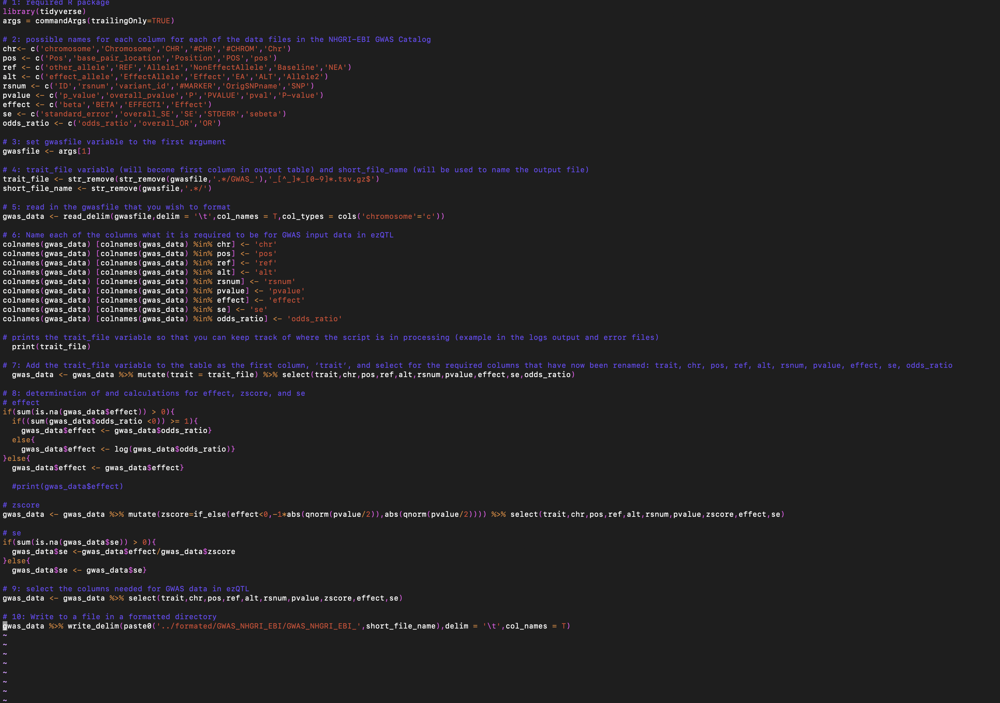
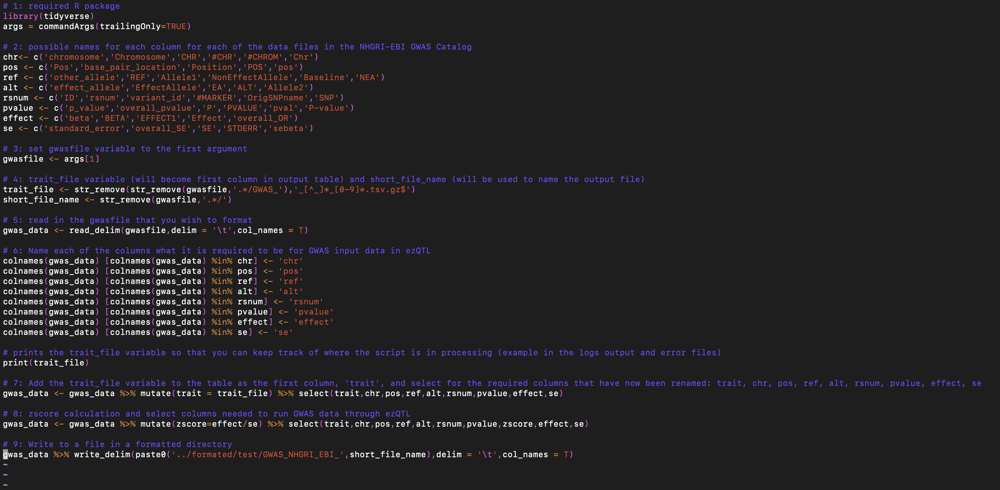

```{r setup, include=FALSE}
knitr::opts_chunk$set(echo = TRUE)
```

There are several required columns in the GWAS data input for ezQTL. These columns include: chromosome (chr), position (pos), reference allele (ref), alternative allele (alt), rsnum, pvalue, zscore (with direction being with regard to the alt allele), effect, and standard error of effect (se). Below is an example table including GWAS summary data from NHGRI-EBI GWAS Catalog, which have been formatted to ezQTL input according to this instruction: 


```{r example_table, echo=FALSE}
library(data.table)
dt = data.table(
  trait = c(rep("GWAS_GCST004415-ovarian-carcinoma", 10)),
  chr = c(rep(10,10)),
  pos= c(60523,60684,60969,61283,61331,61334,61372,61419,62450,63213),
  ref=c("T","A","C","G","A","G","CA","G","G","G"),
  alt =c("G","C","A","A","G","A","C","A","A","C"),
  rsnum=c("rs112920234","rs569167217","rs61838556","rs532801013","rs548639866","rs183305313","rs147855157","rs553163044","rs539912981","rs542543788"),
  pvalue=c(0.8197,0.1791,0.09314,0.9693,0.1797,0.8738,0.4808,0.8029,0.7689,0.1791),
  zscore=c(-0.227931,-1.34353,-1.67906,0.0384862,-1.34168,0.158834,-0.705016,0.249596,-0.293814,-1.34353),
  effect=c(-0.1014,-0.05833,-0.02928,0.008872,-0.05825,0.01967,-0.012,0.0103,-0.07625,-0.05833),
  se=c(0.4447,0.04341, 0.01744,0.2304,0.04341,0.1238,0.01702,0.04127,0.2595,0.04341)
)

dt
```

Several GWAS datasets included in ezQTL are from the NHGRI-EBI GWAS catalog. Included here is an example GWAS formatting workflow to take a data file from the NHGRI-EBI GWAS catalog and format it to be an appropriate and usable input for ezQTL. This workflow includes two steps. The first step is an R script, which takes the original GWAS data file and formats the data to include the required columns for ezQTL that were mentioned above. The second step is a bash script, which takes the output file from step one and matches the reference and alternative alleles to the reference and alternative alleles in the dbSNP database. This step allows for the correct direction of the zscore (and effect) to be determined so that this direction is with regard to the alternative allele. Below is a more detailed explanation of each of these two steps, as well as the example scripts. 

### Step One: R script to format data to include the required ezQTL GWAS columns

##### Several of the GWAS datasets from the NHGRI-EBI catalog look something like the following:
* $1  chromosome : 1
* $2  base_pair_location : 13327
* $3  effect_allele : G
* $4  other_allele : C
* $5  n : 1
* $6  p_value : 0.1259
* $7  odds_ratio : 0.8212
* $8  variant_id : rs144762171
* $9  ci_lower : NA
* $10 ci_upper : NA
* $11 beta : NA
* $12 standard_error : NA
* $13 effect_allele_frequency : NA

Above, we can see that both the beta column and standard_error column are “NA”, causing the need for calculations to determine the correct effect, standard error, and zscore.  The steps from the R script,`Format_GWAS_single_OR.R`, are explained below. There is one input argument for running the script, which is the name of the file that you wish to format.

1. tidyverse is a required R package so that the functions used throughout the script can run. 

```{r tidy, message=FALSE, eval=F, echo=T}
library(tidyverse)
```

2. These lines below account for all of the possible column names used in the original GWAS files that match to the required column names in the input GWAS file for ezQTL. After the file is read, these column names will be matched with those in the original file for the required GWAS column names.

```{r col_names, eval=F, echo=T} 
chr<- c('chromosome','Chromosome','CHR','#CHR','#CHROM','Chr')
pos <- c('Pos','base_pair_location','Position','POS','pos')
ref <- c('other_allele','REF','Allele1','NonEffectAllele','Baseline','NEA')
alt <- c('effect_allele','EffectAllele','Effect','EA','ALT','Allele2')
rsnum <- c('ID','rsnum','variant_id','#MARKER','OrigSNPname','SNP')
pvalue <- c('p_value','overall_pvalue','P','PVALUE','pval','P-value')
effect <- c('beta','BETA','EFFECT1','Effect')
se <- c('standard_error','overall_SE','SE','STDERR','sebeta')
odds_ratio <- c('odds_ratio','overall_OR','OR')
```

3. Set the `gwasfile` variable to the first argument.


```{r gwas_var, eval=F, echo=T}
gwasfile <- args[1]
```

4. Set the `trait_file` variable (will become first column in output table) and `short_file_name` variable (will be used to name the output file).

```{r trait_var, eval=F, echo=T}
trait_file <- str_remove(str_remove(gwasfile,'.*/GWAS_'),'_[^_]*_[0-9]*.tsv.gz$')
short_file_name <- str_remove(gwasfile,'.*/')
```

5. Read in the gwasfile that you wish to format.

```{r read_file, eval=F, echo=T}
gwas_data <- read_delim(gwasfile,delim = '\t',col_names = T,col_types = cols('chromosome'='c'))
```

6. Rename each of the columns to be what the column name is required to be for GWAS data input in ezQTL.

```{r col_ezQTL, eval=F,echo=T}
colnames(gwas_data) [colnames(gwas_data) %in% chr] <- 'chr'
colnames(gwas_data) [colnames(gwas_data) %in% pos] <- 'pos'
colnames(gwas_data) [colnames(gwas_data) %in% ref] <- 'ref'
colnames(gwas_data) [colnames(gwas_data) %in% alt] <- 'alt'
colnames(gwas_data) [colnames(gwas_data) %in% rsnum] <- 'rsnum'
colnames(gwas_data) [colnames(gwas_data) %in% pvalue] <- 'pvalue'
colnames(gwas_data) [colnames(gwas_data) %in% effect] <- 'effect'
colnames(gwas_data) [colnames(gwas_data) %in% se] <- 'se'
colnames(gwas_data) [colnames(gwas_data) %in% odds_ratio] <- 'odds_ratio'
```

7. Add the trait_file variable to the table as the first column, `trait`, and select for the required columns that have now been renamed: `trait`, `chr`, `pos`, `ref`, `alt`, `rsnum`, `pvalue`, `effect`, `se`, `odds_ratio`.

```{r gwas_select, eval=F, echo=T}
gwas_data <- gwas_data %>% mutate(trait = trait_file) %>% select(trait,chr,pos,ref,alt,rsnum,pvalue,effect,se,odds_ratio)
```

8. Determination of and calculations for effect, zscore, and se.

The code to determine the **effect** is as follows:

```{r effect, eval=F, echo=T}
if(sum(is.na(gwas_data$effect)) > 0){
  if((sum(gwas_data$odds_ratio <0)) >= 1){
    gwas_data$effect <- gwas_data$odds_ratio}
  else{
    gwas_data$effect <- log(gwas_data$odds_ratio)}
}else{
  gwas_data$effect <- gwas_data$effect}
```

First, the if statement checks to see if any of the current values pulled for the effect column are “NA”. If there are not any “NAs” in the effect column, then the effect column remains. However, if there is one “NA” value or more, the code moves into the nested if statement, which looks at the values in the odds_ratio column. If any values in the odds_ratio column are negative, it is assumed that this is the effect column. This is because the odds_ratio cannot be negative, and so if values in this column are negative, the log(odds_ratio) was already calculated, and this is the value found here. The effect is equivalent to the log(odds_ratio).  

The code to calculate the **zscore** is as follows:

```{r zscore, eval=F, echo=T}
gwas_data <- gwas_data %>% mutate(zscore=if_else(effect<0,-1*abs(qnorm(pvalue/2)),abs(qnorm(pvalue/2)))) %>% select(trait,chr,pos,ref,alt,rsnum,pvalue,zscore,effect,se)
```

To calculate the zscore correctly, it must be determined what the sign of the log(odds_ratio) (i.e. effect) is. If the effect is less than 0, the sign(logOR) will be -1. In this case, we expect the zscore to be less than 0. In contrast, if the effect is greater than 0, the sign(logOR) will be +1. Here, we expect the zscore to be greater than 0. After determining if an effect is greater than or less than 0, this sign (-1/+1) is multiplied by the abs(qnorm(pvalue/2)) to find the zscore. 

The code to calculate **se** is as follows:

```{r se, eval=F, echo=T}
if(sum(is.na(gwas_data$se)) > 0){
  gwas_data$se <-gwas_data$effect/gwas_data$zscore
}else{
  gwas_data$se <- gwas_data$se}
```

As with the effect determination, to find se, again the number of “NAs” are tabulated for the se column. If there is one “NA” or more, then the se is calculated by dividing the effect by the zscore. (This is just a manipulated version of the common zscore formula, zscore=effect/se).  If there are no “NAs” in the previously selected se column, this se column remains. Otherwise, the se column remains as is from the original file. 

9. Select the columns needed for GWAS data in ezQTL

```{r gwas_final_select, eval=F, echo=T}
gwas_data <- gwas_data %>% select(trait,chr,pos,ref,alt,rsnum,pvalue,zscore,effect,se)
```

10. Write to a file in a formatted directory.

```{r write_to_file, eval=F, echo=T}
gwas_data %>% write_delim(paste0('../formated/GWAS_NHGRI_EBI/GWAS_NHGRI_EBI_',short_file_name),delim = '\t',col_names = T)
```
Below is the entire `Format_GWAS_single_noOR.R` script:
```{r entire_format_OR, eval=F, echo=T}
# 1: required R package
library(tidyverse)
args = commandArgs(trailingOnly=TRUE)

# 2: possible names for each column for each of the data files in the NHGRI-EBI GWAS Catalog
chr<- c('chromosome','Chromosome','CHR','#CHR','#CHROM','Chr')
pos <- c('Pos','base_pair_location','Position','POS','pos')
ref <- c('other_allele','REF','Allele1','NonEffectAllele','Baseline','NEA')
alt <- c('effect_allele','EffectAllele','Effect','EA','ALT','Allele2')
rsnum <- c('ID','rsnum','variant_id','#MARKER','OrigSNPname','SNP')
pvalue <- c('p_value','overall_pvalue','P','PVALUE','pval','P-value')
effect <- c('beta','BETA','EFFECT1','Effect')
se <- c('standard_error','overall_SE','SE','STDERR','sebeta')
odds_ratio <- c('odds_ratio','overall_OR','OR','todds_ratio')

# 3: set gwasfile variable to the first argument
gwasfile <- args[1]

# 4: trait_file variable (will become first column in output table) and short_file_name (will be used to name the output file)
trait_file <- str_remove(str_remove(gwasfile,'.*/GWAS_'),'_[^_]*_[0-9]*.tsv.gz$')
short_file_name <- str_remove(gwasfile,'.*/')

# 5: read in the gwasfile that you wish to format
gwas_data <- read_delim(gwasfile,delim = '\t',col_names = T,col_types = cols('chromosome'='c'))

# 6: Name each of the columns what it is required to be for GWAS input data in ezQTL
colnames(gwas_data) [colnames(gwas_data) %in% chr] <- 'chr'
colnames(gwas_data) [colnames(gwas_data) %in% pos] <- 'pos'
colnames(gwas_data) [colnames(gwas_data) %in% ref] <- 'ref'
colnames(gwas_data) [colnames(gwas_data) %in% alt] <- 'alt'
colnames(gwas_data) [colnames(gwas_data) %in% rsnum] <- 'rsnum'
colnames(gwas_data) [colnames(gwas_data) %in% pvalue] <- 'pvalue'
colnames(gwas_data) [colnames(gwas_data) %in% effect] <- 'effect'
colnames(gwas_data) [colnames(gwas_data) %in% se] <- 'se'
colnames(gwas_data) [colnames(gwas_data) %in% odds_ratio] <- 'odds_ratio'

# prints the trait_file variable so that you can keep track of where the script is in processing (example in the logs output and error files) 
  print(trait_file)

# 7: Add the trait_file variable to the table as the first column, ‘trait’, and select for the required columns that have now been renamed: trait, chr, pos, ref, alt, rsnum, pvalue, effect, se, odds_ratio
  gwas_data <- gwas_data %>% mutate(trait = trait_file) %>% select(trait,chr,pos,ref,alt,rsnum,pvalue,effect,se,odds_ratio)

# 8: determination of and calculations for effect, zscore, and se 
# effect
if(sum(is.na(gwas_data$effect)) > 0){
  if((sum(gwas_data$odds_ratio <0)) >= 1){
    gwas_data$effect <- gwas_data$odds_ratio}
  else{
    gwas_data$effect <- log(gwas_data$odds_ratio)}
}else{
  gwas_data$effect <- gwas_data$effect}

  #print(gwas_data$effect)

# zscore
gwas_data <- gwas_data %>% mutate(zscore=if_else(effect<0,-1*abs(qnorm(pvalue/2)),abs(qnorm(pvalue/2)))) %>% select(trait,chr,pos,ref,alt,rsnum,pvalue,zscore,effect,se)

# se
if(sum(is.na(gwas_data$se)) > 0){
  gwas_data$se <-gwas_data$effect/gwas_data$zscore
}else{
  gwas_data$se <- gwas_data$se}

# 9: select the columns needed for GWAS data in ezQTL
gwas_data <- gwas_data %>% select(trait,chr,pos,ref,alt,rsnum,pvalue,zscore,effect,se)

# 10: Write to a file in a formatted directory
gwas_data %>% write_delim(paste0('../formated/GWAS_NHGRI_EBI/GWAS_NHGRI_EBI_',short_file_name),delim = '\t',col_names = T)

```

Below is a screenshot of the entire script:



**However**, other GWAS datasets from the NHGRI-EBI catalog do not include an ‘odds_ratio’ column, and instead just have a complete ‘effect’ or ‘beta’ column already present. Therefore, this requires slightly less calculations than the first script, but is still very similar.

In the script `Format_GWAS_single_noOR.R`, steps 1-7, and 10 are the same as they were described in the first scenario. The only step that differs is step 8. Since the files without the odds_ration column have a beta (effect) column, and a standard error column, calculations only need to be done to find the zscore.

```{r zscore_calc_noOR, eval=F, echo=T}
gwas_data <- gwas_data %>% mutate(zscore=effect/se) %>% select(trait,chr,pos,ref,alt,rsnum,pvalue,zscore,effect,se)
```

The zscore is calculated by dividing the effect by se. After calculating the zscore, select for the columns needed to run GWAS data through ezQTL. (This is combined with step 9 in the first scenario). Then the result is written to a file. 

Below is the entire `Format_GWAS_single_noOR.R` script:
```{r entire_format_noOR, eval=F, echo=T}
# 1: required R package
library(tidyverse)
args = commandArgs(trailingOnly=TRUE)

# 2: possible names for each column for each of the data files in the NHGRI-EBI GWAS Catalog
chr<- c('chromosome','Chromosome','CHR','#CHR','#CHROM','Chr')
pos <- c('Pos','base_pair_location','Position','POS','pos')
ref <- c('other_allele','REF','Allele1','NonEffectAllele','Baseline','NEA')
alt <- c('effect_allele','EffectAllele','EA','ALT','Allele2')
rsnum <- c('ID','rsnum','variant_id','#MARKER','OrigSNPname','SNP')
pvalue <- c('p_value','overall_pvalue','P','PVALUE','pval','P-value')
effect <- c('beta','BETA','EFFECT1','Effect','overall_OR')
se <- c('standard_error','overall_SE','SE','STDERR','sebeta')

# 3: set gwasfile variable to the first argument
gwasfile <- args[1]

# 4: trait_file variable (will become first column in output table) and short_file_name (will be used to name the output file)
trait_file <- str_remove(str_remove(gwasfile,'.*/GWAS_'),'_[^_]*_[0-9]*.tsv.gz$')
short_file_name <- str_remove(gwasfile,'.*/')

# 5: read in the gwasfile that you wish to format
gwas_data <- read_delim(gwasfile,delim = '\t',col_names = T)

# 6: Name each of the columns what it is required to be for GWAS input data in ezQTL
colnames(gwas_data) [colnames(gwas_data) %in% chr] <- 'chr'
colnames(gwas_data) [colnames(gwas_data) %in% pos] <- 'pos'
colnames(gwas_data) [colnames(gwas_data) %in% ref] <- 'ref'
colnames(gwas_data) [colnames(gwas_data) %in% alt] <- 'alt'
colnames(gwas_data) [colnames(gwas_data) %in% rsnum] <- 'rsnum'
colnames(gwas_data) [colnames(gwas_data) %in% pvalue] <- 'pvalue'
colnames(gwas_data) [colnames(gwas_data) %in% effect] <- 'effect'
colnames(gwas_data) [colnames(gwas_data) %in% se] <- 'se'

# prints the trait_file variable so that you can keep track of where the script is in processing (example in the logs output and error files) 
print(trait_file)

# 7: Add the trait_file variable to the table as the first column, ‘trait’, and select for the required columns that have now been renamed: trait, chr, pos, ref, alt, rsnum, pvalue, effect, se
gwas_data <- gwas_data %>% mutate(trait = trait_file) %>% select(trait,chr,pos,ref,alt,rsnum,pvalue,effect,se)

# 8: zscore calculation and select columns needed to run GWAS data through ezQTL
gwas_data <- gwas_data %>% mutate(zscore=effect/se) %>% select(trait,chr,pos,ref,alt,rsnum,pvalue,zscore,effect,se)

# 9: Write to a file in a formatted directory
gwas_data %>% write_delim(paste0('../formated/test/GWAS_NHGRI_EBI_',short_file_name),delim = '\t',col_names = T)

```

Below is a screenshot of the entire `Format_GWAS_single_noOR.R` script:



### Step Two: bash script to match ref and alt alleles in dbSNP

The second step of the GWAS formatting process is running a bash script to match the reference and alternative alleles in the dataset to those considered the reference and alternative alleles in dbSNP. This is to determine the correction direction of the zscore (and effect) so that it is in reference to the alternative allele (in dbSNP). 

The two input arguments in the bash script, `ezQTL_match.sh`, are the input file, and the desired output file name. In the script, a series of awk statements read the dbSNP file (which contains known rsIDs, chromosome, position, ref, and alt alleles), and generates an array and key. This is followed by two keys being established for the input file. If the reference allele in the input file matches the reference allele in the dbSNP file, the direction of the zscore and effect remains unchanged. However, if the reference allele in the input file is the alternative allele in the dbSNP file, then the direction of the zscore and effect are changed. Below is the `ezQTL_match.sh` script:

```{r ezatl_match, eval=F, echo=T}
#/usr/bin/sh

File=$1
Out=$2

zcat $File| awk  -F "\t" -v OFS="\t" -v out=$Out '                                                                                \
  NR==FNR{split($5,x,","); for(i in x) { $5=x[i]; key=$2":"$3":"$4":"x[i]; a[key]=$2"\t"$3"\t"$4"\t"x[i]"\t"$1;}; next;}          \
  FNR==1{print "#trait\tchr\tpos\tref\talt\trsnum\tpvalue\tzscore\teffect\tse"; next;}                                            \
  {key1=$2":"$3":"$4":"$5; key2=$2":"$3":"$5":"$4; dir=1; if(key1 in a) {value=a[key1]; dir=1; n1++;} else {if(key2 in a) {value=a[key2]; dir=-1; n2++;} else {value=$2"\t"$3"\t"$4"\t"$5"\t"$6;n3++;}}; \
  $8=$8*dir; $9=$9*dir; print $1,value,$7,$8,$9,$10;                                                                                                                                                     \
  }END{print n1,n2,n3 >out"_match_info.txt"}'                                                                                                                                                             \
  /data/ITEB-BRCA/ezQTL/QTL_data/00-All.vcf.id - |bgzip >$Out
```

### Helpful hints when formatting the GWAS data

1. To generate the reference file with SNP data from dbSNP, use the following command:

```{r ref_file, eval=F, eco=T}
wget -c  ftp://ftp.ncbi.nih.gov/snp/organisms/human_9606_b151_GRCh37p13/VCF/00-All.vcf.gz*
bcftools query -f '%ID\t%CHROM\t%POS\t%REF\t%ALT\n' 00-All.vcf.gz >00-All.vcf.id 
```

2. After running the scripts above, you may need to remove rows that do not contain a pvalue > 0. In addition, you may need to sort the output file by chromosome and position in order to be able to generate the index file. If this is the case, you can use the script: `removerows_sort_index.sh` to do so. This simple script removes rows where the pvalue is less than 0, sorts the file by chromosome and position, and indexes the file. Note the different directories the files generated are placed into as the script is run. The final data and index files will be in the `sorted/` directory. Below is the script:

```{r remove_bash, eval= F, echo=T}
#/usr/bin/sh

Out=$1

# remove rows with pval not greater than 0
zcat $Out | awk '{if($7>0) print $0}'| bgzip -c  > refined/$Out

cd refined/

# sort
zcat $Out |sort -k2,2n -k3,3n | bgzip -c > sorted/$Out #sort file  

cd sorted/
# generate index file
tabix -c "#" -s 2 -b 3 -e 3 $Out
```